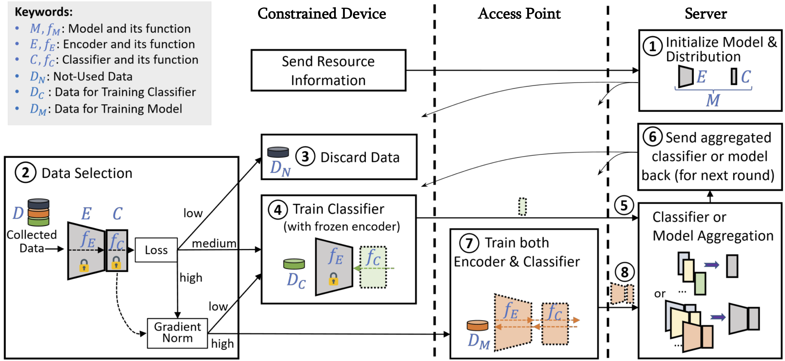
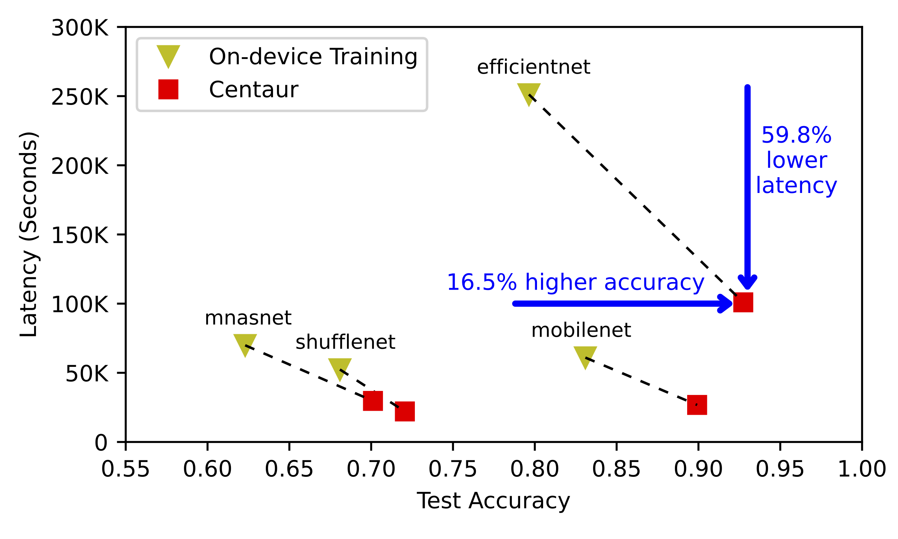
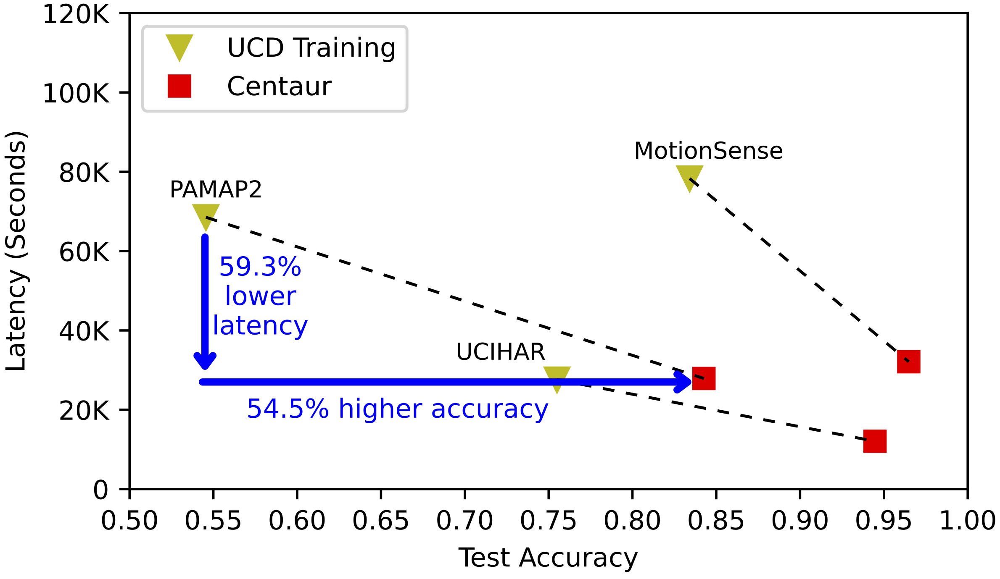

# Data-centric Federated Learning
This repository is dedicated to open-sourcing our works in Federated Learning, emphasizing data-centric methodologies.


# Frameworks:

## List:

The source code associated with our frameworks, presented in our published papers or preprints:

1. See `frameworks/centaur` for **Centaur** framework presented in "[Enhancing Efficiency in Multidevice Federated Learning through Data Selection](https://arxiv.org/abs/2211.04175)"

> The primary version of this work has been presented in ICLR Workshop on Machine Learning for IoT: Datasets, Perception, and Understanding -- Centaur: Federated Learning for Constrained Edge Devices: https://arxiv.org/abs/2211.04175v3

### (1) Centaur

#### Abstract
Federated learning (FL) in multidevice environments creates new opportunities to learn from a vast and diverse amount of private data. Although personal devices capture valuable data, their memory, computing, connectivity, and battery resources are often limited. Since deep neural networks (DNNs) are the typical machine learning models employed in FL, there are demands for integrating ubiquitous constrained devices into the training process of DNNs. In this paper, we develop an FL framework to incorporate on-device data selection on such constrained devices, which allows partition-based training of a DNN through collaboration between constrained devices and resourceful devices of the same client. Evaluations on five benchmark DNNs and six benchmark datasets across different modalities show that, on average, our framework achieves ~19% higher accuracy and ~58% lower latency; compared to the baseline FL without our implemented strategies. We demonstrate the effectiveness of our FL framework when dealing with imbalanced data, client participation heterogeneity, and various mobility patterns. 








#### How to run the code:
(a) **Prerequisites**: Please see `requirements.txt`
> Note that, there might be a problem with older versions of the Flower framework: a problem when running a simulation with ray>=1.12. Ray workers will go into Ray::IDLE mode, which occupies CUDA memory and leads to OOM. For using ray>=1.12 only, a workaround is to change all ray.remote as ray.remote(max_calls=1) in the Flower's ray_client_proxy file.

(b) To Run:
    
        i. Make sure to create directories: `log` nd `results`
        ii. Set up the desired parameters in `unning_args.py`
        ii. Run `python main.py`
(c) For replicating some of the results, run the following command to generate bash scripts: `python make_script.py` and then run specific `.sh` file.


#### Citation
Please use:

```bibtex
@misc{mo2024enhancing,
      title={Enhancing Efficiency in Multidevice Federated Learning through Data Selection}, 
      author={Fan Mo and Mohammad Malekzadeh and Soumyajit Chatterjee and Fahim Kawsar and Akhil Mathur},
      year={2024},
      eprint={2211.04175},
      archivePrefix={arXiv},
      primaryClass={cs.LG}
}
```


        


